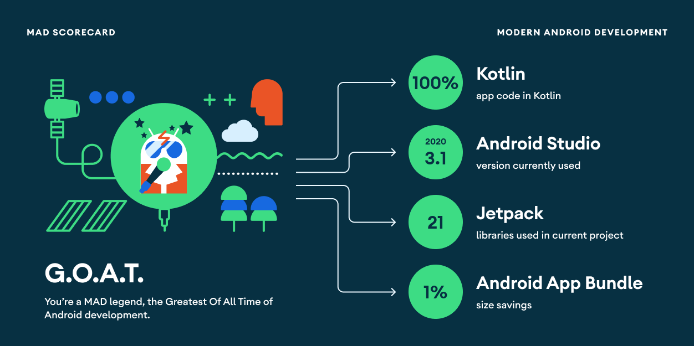

# Curriculum Vitae

[](https://github.com/chrimaeon/curriculumvitae/actions/workflows/main.yml)


This is a [Kotlin Multiplatform] project.

## Android App

An Android App showcasing Jetpack Compose

## Desktop

A Java Desktop App showcasing [Compose for Desktop].

Run `./gradlew :desktop:run` to start the app.

## Web

A JavaScript Web application showcasing [Compose for Web].

You can start the dev server running `./gradlew :web:jsBrowserDevelopmentRun`

## Back end

Ktor Back end for the app

see [backend/README.md]

## Common

The `common` project includes all the shared code across the different platforms. To learn more
check out [Kotlin Multiplatform].

## MAD Scorecard



## License

```text
Copyright (c) 2021. Christian Grach <christian.grach@cmgapps.com>

Licensed under the Apache License, Version 2.0 (the "License");
you may not use this file except in compliance with the License.
You may obtain a copy of the License at

     http://www.apache.org/licenses/LICENSE-2.0

Unless required by applicable law or agreed to in writing, software
distributed under the License is distributed on an "AS IS" BASIS,
WITHOUT WARRANTIES OR CONDITIONS OF ANY KIND, either express or implied.
See the License for the specific language governing permissions and
limitations under the License.
```

[backend/README.md]: /backend/README.md

[Kotlin Multiplatform]: https://kotlinlang.org/docs/mpp-intro.html

[Compose for Desktop]: https://www.jetbrains.com/de-de/lp/compose/

[Compose for Web]: https://compose-web.ui.pages.jetbrains.team/
